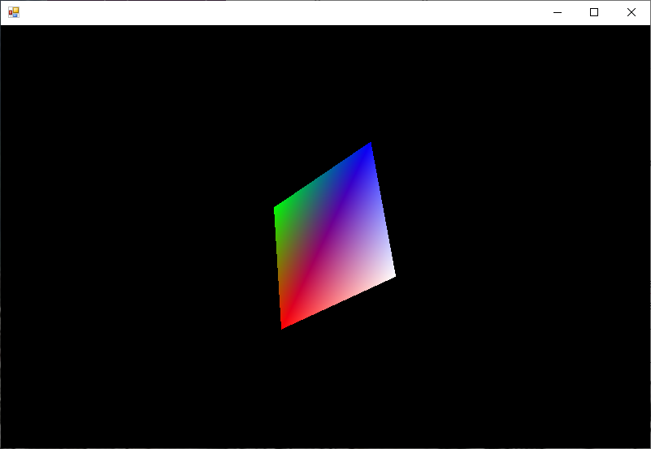

# VulkanSharp
This is my pet project C# Vulkan Bindings.  Originally built just for me to get a better understanding of PInvoke and the Vulkan API.  Intended to be as close to the C API as possible to keep things simple, easy to maintain, and make it easier to use existing tutorials.

These bindings are very heavily derived from VulkanSharp (https://github.com/mono/VulkanSharp) and VulkanCore (https://github.com/discosultan/VulkanCore).  Both are great projects.

## API usage
Everything is in the Vulkan namespace.  All functions are in the static VK class so that using them looks like: VK.CreateInstance(...).  Instance and device extension string names are defined in the static classes InstanceExtensions and DeviceExtensions respectively.

## Extensions
In the case of extensions that need to have thier function pointers loaded from the runtime (some of the platform KHR extensions are provided by the loader), there is a static extension class with a single init() function. It is up to the user to check that the extension exists prior to calling the init function to get the function pointers and setup the delgates.  For example: VK_EXT_debug_report.init(instance) will set VK.CreateDebugReportCallbackEXT if it exists.  If the extension isn't present and the init fuction is called an exception will be thrown.

## API deviation
I don't have a lot of use for the allocator struct at the moment.  In vulkan functions that takes an allocator struct where it wasn't the last parameter, I reorded the parameters it in the public function so that I could have a default value of null.  This is mostly just an athestics thing, that and custom allocators don't really make much sense at the moment.  We're really not pushing for performance in this project. 

## Coverage
I'm slowely working through the functions and extensions as I use them.  I'm still working through the tutorials, but the goal is to have 100% coverage of the base API, plus all extensions that I'm using (currently the windows platform swapchain/display and EXT debug extensions).  If there is an extension that you want, please let me know and I'll prioritize it.

## Current Status
I'm using the 1.1.107 vk.xml spec to generate the structs, enums, fuctions, and extensions.  I then lovingly, hand massage them so they work.  

